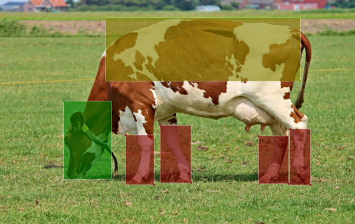

# Cattle Body Parts Image Dataset for Object Detection
<div style="display: flex; gap: 10px; flex-wrap: wrap;">
    
    
    
</div>
<br/>
This dataset is a curated collection of images featuring various cattle body parts aimed at facilitating object detection tasks. The dataset contains a total of 428 high-quality photos, meticulously annotated with three distinct classes: "Back," "Head," and "Leg."

The dataset can be downloaded using [this link](https://www.kaggle.com/datasets/alikhalilit98/cattle-body-parts-dataset-for-object-detection). The dataset is also available at Roboflow Universe. 

<p align="center">
    <a href="https://universe.roboflow.com/ali-khalili/cattle-body-parts-dataset-for-object-detection">
        </img>
    </a>
</p>

A YOLOv7X model has been trained using the dataset and achieved a mAP of 99.6%. You can access the trained weights through [this link](https://huggingface.co/alikhalilit98/Cattle-Body-Parts-Dataset-for-Object-Detection/blob/main/yolov7_cattle_parts_final.pt).

<!--
### Acquisition
The dataset creation involved the following steps:

- **Initial Data:** Images were collected and annotated to create a base dataset for training.
- **Model Training:** A [YOLOv7](https://github.com/WongKinYiu/yolov7) model was trained to recognize target objects in the annotated images.
- **Data Acquisition Script:** An automated script fetched videos from the internet.
- **Conversion and Filtering:** Videos were turned into frames; similar frames were filtered out using Cosine Similarity.
- **Object Detection:** The trained model identified objects in the new images.
- **Quality Check:** A comprehensive review ensured dataset accuracy and consistency.
-->

## Motivation
Accurate and reliable identification of different cattle body parts is crucial for various agricultural and veterinary applications. This dataset aims to provide a valuable resource for researchers, developers, and enthusiasts working on object detection tasks involving cattle, ultimately contributing to advancements in livestock management, health monitoring, and related fields.

## Data 
### Overview
- Total Images: 428
- Classes: Back, Head, Leg
- Annotations: Bounding boxes for each class

Below is an example image from the dataset.

<div align="center">
  
</div>

### Contents
```
📦 Cattle_Body_Parts_OD.zip
 ┣ 📂 images
 ┃  ┣ 📜 image1.jpg
 ┃  ┣ 📜 image2.jpg
 ┃  ┗ ...
 ┗ 📂 annotations
    ┣ 📜 image1.json
    ┣ 📜 image2.json
    ┗ ...
```

### Annotation Format
Each annotation file corresponds to an image in the dataset and is formatted as per the [LabelMe](https://github.com/wkentaro/labelme) [JSON](https://www.json.org/json-en.html) standard. These annotations define the bounding box coordinates for each labeled body part, enabling straightforward integration into object detection pipelines.

## License
<a rel="license" href="http://creativecommons.org/licenses/by/4.0/"></a><br />This work is licensed under a <a rel="license" href="http://creativecommons.org/licenses/by/4.0/">Creative Commons Attribution 4.0 International License</a>.

## Disclaimer
This dataset has been collected from publicly available sources. I do not claim ownership of the data and have no intention of infringing on any copyright. The material contained in this dataset is copyrighted to their respective owners. I have made every effort to ensure the data is accurate and complete, but I cannot guarantee its accuracy or completeness. If you believe any data in this dataset infringes on your copyright, please get in touch with me immediately so I can take appropriate action.
